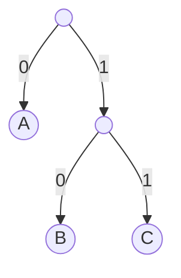
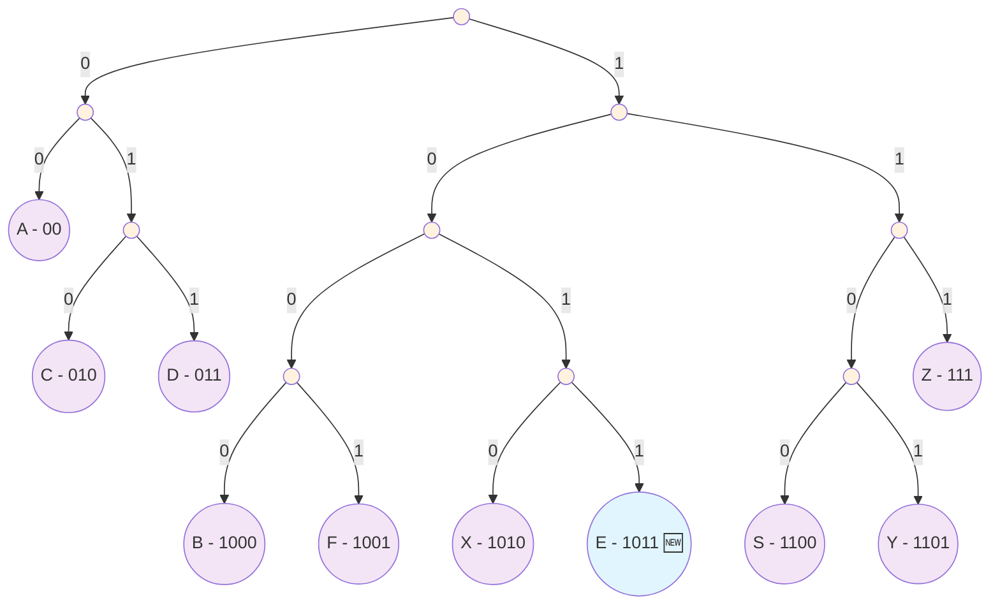

# Задание №4 - Кодирование и декодирование информации

[← Вернуться к списку заданий](../README.md)

## 📋 Содержание
- [📖 Теория](#📖-теория)
- [🔍 Разбор](#🔍-разбор)
- [💡 Рекомендации](#💡-рекомендации)
- [⚠️ Типичные ошибки](#⚠️-типичные-ошибки)
- [📝 Рекомендованные задания](#📝-рекомендованные-задания)

---

## 📖 Теория

### 🔤 Основы кодирования

**Кодирование информации** — это процесс преобразования информации из одной формы представления в другую, удобную для передачи, хранения или обработки.

### 📊 Типы кодов

1. **Равномерные коды** — все кодовые слова имеют одинаковую длину
   - Пример: ASCII (8 бит на символ)
   - Простота декодирования, но не всегда оптимальны по длине

2. **Неравномерные коды** — кодовые слова могут иметь разную длину
   - Пример: код Морзе, код Хаффмана
   - Позволяют сократить среднюю длину сообщения

### 🌳 Условие Фано (префиксное свойство)

**Условие Фано** — ни одно кодовое слово не является началом (префиксом) другого кодового слова.

**Почему это важно:**
- Обеспечивает **однозначность декодирования**
- Позволяет декодировать сообщение **слева направо** без возврата
- Исключает неопределенность при расшифровке

**Примеры:**

✅ **Удовлетворяет условию Фано:**
```
A: 0
B: 10  
C: 11
```

❌ **Нарушает условие Фано:**
```
A: 0
B: 01  ← начинается с кода A
C: 11
```

### 🌲 Двоичные деревья кодирования

Коды, удовлетворяющие условию Фано, можно представить в виде **двоичного дерева**:

- **Левая ветвь** — бит "0"
- **Правая ветвь** — бит "1"  
- **Листья** — символы алфавита
- **Путь от корня к листу** — кодовое слово

**Пример дерева:**



Коды: A=0, B=10, C=11

### 🔍 Алгоритм поиска кодового слова

1. **Построить дерево** из существующих кодов
2. **Найти свободные позиции** (узлы без символов)
3. **Выбрать кратчайший путь** с наименьшим числовым значением
4. **Проверить совместимость** с возможными будущими кодами

---

## 🔍 Разбор заданий

### 📝 Пример задания

**Условие:** По каналу связи передаются шифрованные сообщения, содержащие только десять букв: A, B, C, D, E, F, S, X, Y, Z; для передачи используется неравномерный двоичный код.

**Дана таблица кодов:**

| Буква | Код  | Буква | Код  |
|-------|------|-------|------|
| A     | 00   | F     | 1001 |
| B     | 1000 | S     | 1100 |
| C     | 010  | X     | 1010 |
| D     | 011  | Y     | 1101 |
| E     | ?    | Z     | 111  |

**Задача:** Найти кратчайшее кодовое слово для буквы E, удовлетворяющее условию Фано. Если таких кодов несколько, выбрать код с наименьшим числовым значением.

### 🌲 Решение через построение двоичного дерева

#### **Шаг 1: Анализ существующих кодов**

Сначала проанализируем все данные коды:
- **A: 00** (длина 2)
- **B: 1000** (длина 4) 
- **C: 010** (длина 3)
- **D: 011** (длина 3)
- **F: 1001** (длина 4)
- **S: 1100** (длина 4)
- **X: 1010** (длина 4)
- **Y: 1101** (длина 4)
- **Z: 111** (длина 3)

#### **Шаг 2: Построение двоичного дерева**

Строим дерево пошагово, размещая каждый код:



**Размещение кодов по дереву:**
- **A (00):** корень → 0 → 0
- **C (010):** корень → 0 → 1 → 0  
- **D (011):** корень → 0 → 1 → 1
- **B (1000):** корень → 1 → 0 → 0 → 0
- **F (1001):** корень → 1 → 0 → 0 → 1
- **X (1010):** корень → 1 → 0 → 1 → 0
- **S (1100):** корень → 1 → 1 → 0 → 0
- **Y (1101):** корень → 1 → 1 → 0 → 1
- **Z (111):** корень → 1 → 1 → 1

#### **Шаг 3: Поиск свободных позиций для E**

Анализируем свободные позиции в дереве:

**Длина 1:**
- **0** — занято (ведет к A)
- **1** — занято (ведет к другим символам)

**Длина 2:**
- **00** — занято (A)
- **01** — занято (ведет к C и D)
- **10** — занято (ведет к B, F, X)
- **11** — занято (ведет к S, Y, Z)

**Длина 3:**
- **010** — занято (C)
- **011** — занято (D)
- **100** — занято (ведет к B и F)
- **101** — занято (ведет к X)
- **110** — занято (ведет к S и Y)
- **111** — занято (Z)

**Длина 4:**
- **1000** — занято (B)
- **1001** — занято (F)
- **1010** — занято (X)
- **1011** — 🟢 **СВОБОДНО!**
- **1100** — занято (S)
- **1101** — занято (Y)
- **1110** — 🟢 **СВОБОДНО!**
- **1111** — ❌ нарушает условие Фано (является продолжением Z=111)

#### **Шаг 4: Выбор оптимального кода**

Из свободных позиций длины 4:
- **1011** (числовое значение: 11 в десятичной системе)
- **1110** (числовое значение: 14 в десятичной системе)

Выбираем **1011**, так как:
1. ✅ Кратчайший из возможных (длина 4)
2. ✅ Наименьшее числовое значение среди кратчайших
3. ✅ Удовлетворяет условию Фано

#### **Шаг 5: Проверка условия Фано**

**Проверяем код E = 1011:**

1. **Не является началом других кодов** ✅
   - Ни один существующий код не начинается с 1011

2. **Не имеет других кодов как свои начала** ✅
   - 1 — не является отдельным кодом
   - 10 — не является отдельным кодом  
   - 101 — не является отдельным кодом

3. **Совместимость с будущими кодами** ✅
   - При добавлении новых символов достаточно свободных позиций

### 🎯 Окончательный ответ

**E = 1011**

### 📊 Итоговая таблица кодов

| Буква | Код  | Длина |
|-------|------|-------|
| A     | 00   | 2     |
| B     | 1000 | 4     |
| C     | 010  | 3     |
| D     | 011  | 3     |
| **E** | **1011** | **4** |
| F     | 1001 | 4     |
| S     | 1100 | 4     |
| X     | 1010 | 4     |
| Y     | 1101 | 4     |
| Z     | 111  | 3     |

### 🔧 Программный способ решения

```python
# Все известные коды
knowns = ['00', '1000', '010', '011', '1001', '1100', '1010', '1101', '111']

# Генерируем все возможные двоичные коды от 0 до 31 (5 битов)
codes = [bin(i)[2:] for i in range(32)]

# Фильтруем коды, которые удовлетворяют условию Фано:
# - код не должен начинаться с известного кода
# - известный код не должен начинаться с нашего кода
codes = [code for code in codes if not any(code.startswith(known) or known.startswith(code) for known in knowns)]

print(codes)
```

**Результат выполнения:**
```
['1011', '1110', '11110', '11111']
```

**Разбор решения:**

1. **`bin(i)[2:]`** — преобразует число в двоичную строку без префикса '0b'
   - `bin(11)[2:]` → '1011'
   - `bin(14)[2:]` → '1110'

2. **`code.startswith(known)`** — проверяет, не начинается ли наш код с известного
   - Например: '10110'.startswith('1011') → True (нарушение Фано)

3. **`known.startswith(code)`** — проверяет, не начинается ли известный код с нашего
   - Например: '111'.startswith('11') → True (нарушение Фано)

4. **`not any(...)`** — исключает коды, нарушающие условие Фано

**Выбор ответа:**
Из найденных кодов ['1011', '1110', '11110', '11111'] выбираем **'1011'**, так как:
- ✅ Кратчайший (длина 4)
- ✅ Минимальное числовое значение среди кратчайших (11 < 14)

**Ответ: E = 1011**

---

## 💡 Рекомендации

### 🎯 Стратегии решения

**1. Метод построения дерева (рекомендуемый):**
- Строим двоичное дерево из существующих кодов
- Находим свободные листья
- Выбираем кратчайший путь с минимальным числовым значением

**2. Переборный метод:**
- Последовательно перебираем кодовые слова по возрастанию длины
- Для каждого кода проверяем условие Фано
- Выбираем первый подходящий код

**3. Аналитический метод:**
- Анализируем занятые префиксы
- Определяем минимальную возможную длину
- Находим код методом исключения

### 🔧 Основные принципы решения:

1. **Понимание условия Фано** — ни одно кодовое слово не является началом другого
2. **Систематический перебор** — проверка кодовых слов в порядке возрастания длины
3. **Проверка совместимости** — учёт уже существующих кодовых слов
4. **Оптимизация длины** — поиск кодового слова минимальной длины

### 📝 Пошаговый алгоритм

**Шаг 1:** Выписать все существующие коды и их длины
**Шаг 2:** Построить дерево или проанализировать занятые префиксы
**Шаг 3:** Найти минимальную длину для нового кода
**Шаг 4:** Перебрать коды этой длины в порядке возрастания
**Шаг 5:** Проверить условие Фано для каждого кандидата
**Шаг 6:** Выбрать первый подходящий код

### 🧮 Быстрые проверки

**Проверка условия Фано:**
- Новый код не должен начинаться с существующего кода
- Существующие коды не должны начинаться с нового кода

**Оценка минимальной длины:**
- Если все коды длины N заняты, минимальная длина ≥ N+1
- Учитывать структуру дерева и занятые ветви

---

## ⚠️ Типичные ошибки

### 🚫 Частые проблемы:

1. **Невнимательное чтение условия** — пропуск требований к минимальной/максимальной длине или числовому значению
2. **Нарушение условия Фано** — выбор кодового слова, являющегося началом другого
3. **Забывчивость о других буквах** — неучёт необходимости кодирования оставшихся символов
4. **Ошибки в переборе** — пропуск подходящих вариантов

### ❌ Конкретные примеры ошибок:

**Ошибка 1: Неправильная интерпретация условия Фано**
```
Дано: A=0, B=10, C=11
Неправильно: E=01 (A=0 является началом E=01)
Правильно: E=00 или другой код без нарушений
```

**Ошибка 2: Игнорирование требования минимальности**
```
Найдены подходящие коды: 1011, 1110, 10110
Неправильно: выбрать 10110 (не минимальной длины)
Правильно: выбрать 1011 (кратчайший)
```

**Ошибка 3: Неучёт числового значения**
```
Найдены коды одинаковой длины: 1011, 1110
Неправильно: выбрать 1110 
Правильно: выбрать 1011 (меньше числовое значение: 11 < 14)
```

**Ошибка 4: Неполная проверка Фано**
```
Проверили только "E не начинается с других кодов"
Забыли проверить "другие коды не начинаются с E"
```

### ✅ Как избежать ошибок:

- **Внимательно читайте все условия** задания
- **Рисуйте дерево** — визуализация помогает избежать ошибок
- **Проверяйте Фано в обе стороны** — и префиксы, и суффиксы
- **Следуйте системному подходу** — не пропускайте этапы алгоритма

---

## 📝 Рекомендованные задания

### 🎯 Базовый уровень

1. **Простая задача на Фано:**
   ```
   Дано: A=0, B=10, C=110
   Найти код для D (кратчайший с минимальным значением)
   ```

2. **Средняя задача:**
   ```
   Дано: A=00, B=01, C=100, D=101
   Найти код для E
   ```

### 🎯 Продвинутый уровень

3. **Комплексная задача:**
   ```
   Дано 8 символов с кодами, найти коды для двух оставшихся
   с учетом дополнительных ограничений
   ```

4. **Задача на анализ:**
   ```
   Дана таблица с ошибками в кодах
   Найти и исправить нарушения условия Фано
   ```

---

## ✅ Практика

### 🧪 Тренировочные задачи

**Задача 1:**
По каналу связи передаются сообщения, содержащие буквы A, B, C, D, E. Используется неравномерный двоичный код:

| Буква | Код |
|-------|-----|
| A     | 10  |
| B     | 01  |
| C     | 001 |
| D     | ?   |
| E     | 000 |

Найдите кратчайший код для буквы D.

<details>
<summary>💡 Подсказка</summary>

Постройте дерево из существующих кодов и найдите свободные позиции.

</details>

<details>
<summary>✅ Ответ</summary>

**Ответ: 11**

Построение дерева показывает, что код 11 является кратчайшим свободным кодом, удовлетворяющим условию Фано.

</details>

---

**Задача 2:**
Для букв A, B, C, D, E, F используются коды:

| Буква | Код  |
|-------|------|
| A     | 000  |
| B     | 001  |
| C     | 01   |
| D     | 100  |
| E     | ?    |
| F     | 111  |

Найдите код для E с минимальным числовым значением.

<details>
<summary>💡 Подсказка</summary>

Проанализируйте, какие коды длины 2 и 3 уже заняты или недоступны из-за условия Фано.

</details>

<details>
<summary>✅ Ответ</summary>

**Ответ: 101**

Коды 10 и 11 недоступны (нарушают условие Фано). Из кодов длины 3: 101 имеет минимальное числовое значение среди доступных.

</details>

---

### 🎓 Задачи ЕГЭ прошлых лет

**Задача 3 (ЕГЭ 2023):**
По каналу связи передаются сообщения, содержащие только семь букв: A, B, C, D, E, F, G. Для передачи используется неравномерный двоичный код:

| Буква | Код  |
|-------|------|
| A     | 00   |
| B     | 010  |
| C     | 011  |
| D     | 100  |
| E     | ?    |
| F     | 110  |
| G     | 111  |

Укажите кратчайшее кодовое слово для буквы E.

<details>
<summary>✅ Ответ</summary>

**Ответ: 101**

После построения дерева видно, что 101 — единственный доступный код длины 3.

</details>

---

### 🔬 Исследовательские задачи

**Задача 4:**
Придумайте свою систему кодирования для 6 букв, где:
- Все коды удовлетворяют условию Фано
- Средняя длина кода минимальна
- Используются только коды длины 2 и 3

**Задача 5:**
Исследуйте: какое максимальное количество символов можно закодировать кодами длины не более 4, если коды должны удовлетворять условию Фано?
- **Проверяйте условие Фано** для каждого нового кодового слова
- **Учитывайте возможность кодирования** всех оставшихся букв
- **Используйте систематический подход** к перебору вариантов

---

## 📝 Рекомендованные задания

### 🔗 Какие задания открытого банка выполнить для тренировки

**Номера заданий из открытого банка ФИПИ:**

| № | Код | № | Код | № | Код | № | Код | № | Код |
|:-:|:-:|:-:|:-:|:-:|:-:|:-:|:-:|:-:|:-:|
| 1 | 0D5D7E | 6 | 38AA15 | 11 | A2F421 | 16 | EE7DB0 | 21 | 04FD12 |
| 2 | 858F4B | 7 | 460D7D | 12 | 29A87E | 17 | B85498 | 22 | 364539 |
| 3 | 734D40 | 8 | 504F2E | 13 | 9AF5CD | 18 | 67E8B4 | 23 | B17711 |
| 4 | B8EB09 | 9 | 7AD871 | 14 | CE447D | 19 | 15013A | 24 | 883C3B |
| 5 | 882400 | 10 | CF8A23 | 15 | 3A22BB | 20 | 6D433E | 25 | 349C1D |
|   |        |    |        |    |        |    |        | 26 | F9598B |

### 🌐 Как найти задания:

1. Перейдите на сайт **[fipi.ru](https://fipi.ru/ege/otkrytyy-bank-zadaniy-ege)**
2. Выберите **"Информатика и ИКТ"**
3. Найдите **"Задание 4"** в списке
4. Используйте **поиск по коду** задания (например, "0D5D7E")

### ⏱️ Контроль времени:

- **На экзамене** у вас будет 3-4 минуты на это задание
- **Тренируйте переборные алгоритмы** до автоматизма
- **Отрабатывайте проверку** условия Фано

---

## ✅ Практика

*Задания для самостоятельной работы будут добавлены позже*

---

[← Предыдущее задание](task-03.md) | [Следующее задание →](task-05.md)
